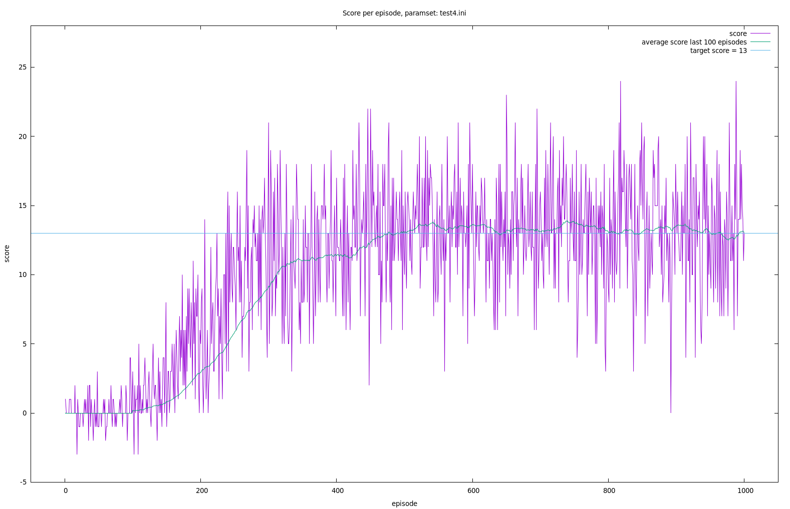

# Introduction

This project is my (Matthias Schinacher) solution to a homework assignment for Udacity's Deep Reinforcement Learning Nano Degree.  
It contains mainly a python implementation of the Q- learning algorithm with replay-memory, using a
neural network implemented with pytorch as the Q-function approximation.

# Project Details

The environment ist very similar to/ a variant of the "Bananas Collector"
environment from Unity; [Unity ML-Agents GitHub](https://github.com/Unity-Technologies/ml-agents/blob/master/docs/Learning-Environment-Examples.md#banana-collector).

In the environment an agent navigates a large square worlds. Within this world there are yellow and purple
bananas (and they also pop into existence). The agent has 4 possible actions (forward, backward, left right)
and needs to increase his score by collecting yellow bananas (+1) while avoiding to hit puple ones (-1).

The environment can be accessed via python/ has a python interface.
The state space is a vector of 37 numeric values (that represent the agents velocity and ray- based perceptions).

The defined goal of the homework/ project is/was to achieve a "sustained" score of at least 13 per episode.
That means, that the algorithm/ the model should be able to average above score 13 for "the last 100 episodes"
over a number of episodes.

# Dependencies
The actual "program" (agent) is a python script that can be run from the command line.
To be able to run it, python 3.6 must be installed.

## Python packages
The following packages/ libraries are needed

- tensorflow, version 1.7.1
- numpy, at least version 1.11.0
- torch, version 0.4.0 (pytorch)

## Other dependecies
A minimal install of OpenAI gym is required, as well as the classic control environment group
and the box2d environment group; instructions how to install this [can be found here](https://github.com/openai/gym).

Additionally one needs the "Banana" environment from udacity, which was created for the course.
This can be downloaded [for Linux](https://s3-us-west-1.amazonaws.com/udacity-drlnd/P1/Banana/Banana_Linux.zip)
(and other operating systems).

# Running the script/ program/ agent
To run the script from the command line (Linux), the dependencies mentioned must be installed and the contents
of the "Banana_Linux.zip" need to be unzipped in the same directory, where the actual script "ms_drlndnav_pr.py"
resides, so that we have a subdirectory "Banana_Linux".

    python ms_drlndnav_pr.py command-file.ini

will start the agent as per the parameters in the file "command-file.ini".
Depending on the contents of the command-file, the agent will try to solve the environment and train a neural network
to approximate a state-action function; or the script will load a predefined NN- model from a file and only play
the banana- environment as a game with a fixed strategy. For more details see also the project- report.

## Parameters
The format of a command-file is like that of the standard python "configparser" lib, which is similar to the known
Windows INI format (see examples from the command ZIP- archive).

- global
    - runlog: name of the logfile to use
- mode
    - train: whether we're in training mode
    - show: flag, whether to show the game in "human time"
- rand
    - seed: seed for random number generation
- model
    - h1: first size- parameter for the NN- model
    - h2: second size- parameter for the NN- model
    - load_file: load model from this file
    - load_transitions_file: load replay-memory transitions from this file
    - save_file: save final Q- model to this file
    - save_best_file: save Q- model from episode with highest score to this file
    - save_transitions_file: save replay-memory transitions to this file
    - tanh: use Tanh- layers instead of ReLU- layers
- hyperparameters
    - episodes: number of episodes to run
    - warmup_episodes: epiosodes to run with pure random sampling
    - epsilon_episodes: number of episodes over which to descrease epsilon
    - epsilon_start: start- value for epsilon
    - epsilon_end: final value for epsilon
    - replay_buffersize: size of the replay memory
    - replay_batchsize: number of transitions to sample per optimizing step
    - replay_steps: game-steps between each optimizing step
    - prio_replay: flag, whether to use priority replay
    - q_reset_steps: reset the parameters of the "fixed" Q- model after this many steps
    - gamma: gamma (Q- learning parameter)
    - learning_rate: the learning rate

### Example command-file contents
    
    [global]  
    runlog = test4.log
     
    [mode]
    train = 1
    
    [rand]
    seed = 4719
    
    [model]
    h1 = 10
    h2 = 10
    save_file = test4.model
    save_best_file = test4.best.model
    save_transitions_file = test4.transitions
    tanh = False
    
    [hyperparameters]
    episodes           = 1000
    warmup_episodes    = 10
    epsilon_episodes   = 200
    epsilon_start      = 0.99
    epsilon_end        = 0.01
    replay_buffersize  = 30000
    replay_batchsize   = 300
    replay_steps       = 1
    prio_replay        = False
    q_reset_steps      = 30
    gamma              = 0.99
    learning_rate      = 0.001

## Output
### Logfile
The main output is a log file which contains various information as within #- style comment lines
and the time-series data of
- Episode- number
- Score (at episode end)
- Average Score of the last 100 episodes (the very episode score and the 99 episodes before it)
- The number of steps in this episode
- The epsilon used for the episode

Example:

    ...
    # Episode Score average(last-100-Scores) Steps Epsilon
    1 1.0 0.0 300 0.99
    ...
    16 0.0 0.0 300 0.9607462686567165
    17 0.0 0.0 300 0.9558706467661693
    18 -3.0 0.0 300 0.950995024875622
    19 1.0 0.0 300 0.9461194029850748
    20 0.0 0.0 300 0.9412437810945276
    21 -1.0 0.0 300 0.9363681592039803
    22 -1.0 0.0 300 0.9314925373134331
    23 0.0 0.0 300 0.9266169154228858
    ...

### Model file
The script allowes for the saving/loading of the NN- model in the binary format as used by pytorch's
functions "torch.load(..)" and "torch.save(..)".

### Transitions/ replay-memory
The script allowes for the saving/loading of the transition- replay-memory (replay-buffer) using the
binary pickle- format as from the python pickle- module.

# The solution
The solution to the project task is, apart from the python script, contained within the command file "test4.ini".
To recreate the model and plot data, extract "test4.ini" from the "command-file"- ZIP archive and run:

    python ms_drlndnav_pr.py test4.ini

After that the file "test4.log" should contain the time-series output of the experiment and the files
"test4.model", "test4.best.model" should contain the model and "test4.transitions" the final replay-memory.

# Misc
## Model output

With the simple python script "print_model.py" it's possible to output the NN- model parameters from a
model- file that was written by a run of the main script. Example:

    python print_model.py test4.model

## The "best" model

The program/ script can output 2 different models at the end of a run. The "best" model, that is the model at the
end of the highest scoring episode, and the "normal" model at the end of the script run, the final model corresponding
with the potentially also saved replay-memory (pickle file).

## ZIP- archives
### INIS.zip
List of sample command-files, that I used for my experiments.

### LOGS.zip
Logs from the script runs with the sample command-files.

### MODELS.zip
Models and transitions/replay-buffer (binary format) from the script runs with the sample command-files.

### PNGS.zip
Pictures created with gnuplot from the log-files and used for the project report.

## See also
* report.pdf: the project report, contains additional information
